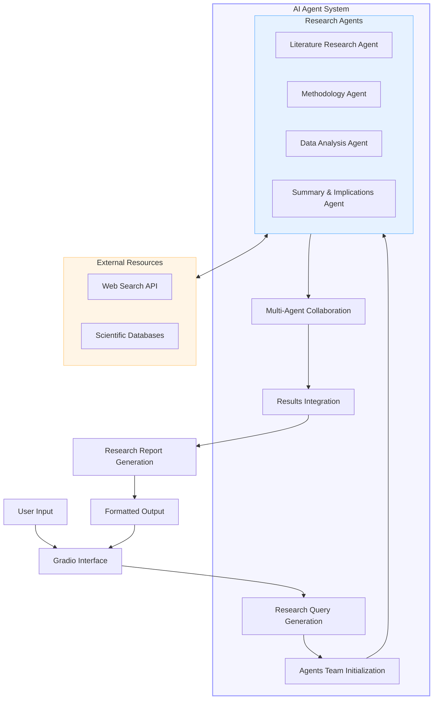

# 🔬 AI Science Research Assistant

A multi-agent AI system for generating comprehensive scientific research reports using advanced language models and web search capabilities.

## Overview

The AI Science Research Assistant utilizes four specialized AI agents to gather and synthesize the latest scientific research on any topic. Each agent handles a different aspect of the research process, creating a thorough and insightful final report.

## System Architecture



## Agents

1. **Literature Research Agent** - Searches for and analyzes relevant academic papers, research articles, and publications on the specified topic.

2. **Methodology Agent** - Evaluates research methodologies, experimental designs, and approaches used in the literature.

3. **Data Analysis Agent** - Focuses on statistical methods, data interpretation, and the significance of research findings.

4. **Summary & Implications Agent** - Synthesizes research to provide a clear overview, identify trends, and suggest future research directions.

## Setup

### Prerequisites

- Python 3.8+
- Gradio
- Access to LLM APIs (Groq in this implementation)
- Brave Search API key

### Installation

1. Clone this repository
```bash
git clone https://github.com/yourusername/ai-science-research-assistant.git
cd ai-science-research-assistant
```

2. Install required packages
```bash
pip install -r requirements.txt
```

3. Create a `.env` file in the project root with your API keys
```
GROQ_API_KEY=your_groq_api_key
BRAVE_API_KEY=your_brave_api_key
OPENAI_API_KEY=your_openai_api_key  # optional alternative
```

## Usage

### Web Interface

Run the application and access the web interface:

```bash
python app.py
```

Navigate to the provided URL (typically http://127.0.0.1:7860) in your browser.

### Using the Interface

1. Enter your research topic (e.g., "CRISPR gene editing applications")
2. Specify the scope of research (e.g., "Last 5 years, medical applications")
3. Indicate the desired technical depth (e.g., "Graduate level, include technical details")
4. Share specific focus areas (e.g., "Clinical trials, ethical considerations, recent breakthroughs")
5. Click "Generate Research Report"

### CLI Usage

You can also use the system programmatically:

```python
from app import generate_research_report

report = generate_research_report(
    topic="Quantum computing algorithms",
    scope="Last 2 years, focus on cryptography",
    depth="Advanced technical level",
    focus_areas="Post-quantum security, optimization problems"
)
print(report)
```

## Features

- **Comprehensive Research**: Combines findings from multiple sources into a cohesive report
- **Multi-Agent Design**: Specializes different aspects of the research process
- **Customizable Depth**: Adapts to different technical knowledge levels
- **Focused Analysis**: Targets specific aspects of interest within broader topics
- **User-Friendly Interface**: Simple web UI for generating reports

## Limitations

- The quality of reports depends on the availability of online research information
- Not a substitute for in-depth human expert analysis
- May not have access to the latest papers or research behind paywalls
- LLM capabilities and knowledge cutoffs apply

## License

MIT License

## Acknowledgments

- [Praison AI Agents](https://github.com/praison/ai-agents) for the multi-agent framework
- [Gradio](https://gradio.app/) for the web interface
- [Llama](https://github.com/facebookresearch/llama) for the language model capabilities